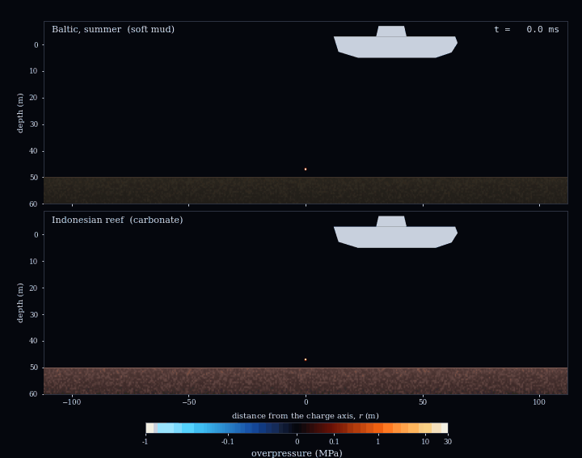
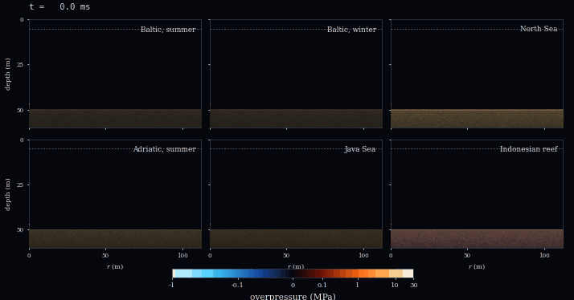
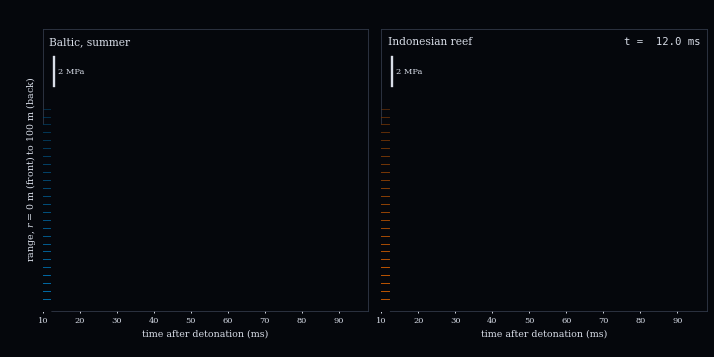

# Legacy Naval Mines across Ocean Regimes: Idealized Shock, Cavitation, and Bubble Loading

[](https://www.python.org)
[](https://numpy.org)
[](https://scipy.org)
[](https://www.teos-10.org)
[](https://peps.python.org/pep-0008/)
[](LICENSE)

Supplementary code for an idealized, data-free comparison of how the
water column and seabed of six seas shape the loading that one legacy
naval charge delivers to a vessel above it.

**Authors:** Sandy H. S. Herho, Candrasa S. Dharma, Agus W. Jatmiko, Rusmawan Suwarman, Deny J. Puradimaja, and Dasapta E. Irawan

<p align="center">
  <br>
  <sub>One 300 kg TNT-equivalent charge 3 m above the seabed, Baltic in summer (top) and Indonesian carbonate reef (bottom). Pale veils are cavitated water; the disc is the gas bubble at its Rayleigh-Plesset radius.</sub>
</p>

<table>
  <tr>
    <td align="center"></td>
    <td align="center"></td>
  </tr>
  <tr>
    <td align="center"><sub>The same charge in six seas</sub></td>
    <td align="center"><sub>Incident pressure along the keel line, 0 to 100 m</sub></td>
  </tr>
</table>

## Model

Linearized mass and momentum balance in cylindrical symmetry about the
charge axis, with a point volume source Q(t),

```math
\partial_t s = -\nabla\cdot\mathbf{u} + Q(t)\,\delta(\mathbf{x}-\mathbf{x}_s), \qquad
\rho\,\partial_t\mathbf{u} = -\nabla p, \qquad
p = \max\!\left(\rho c^2 s,\; p_v - p_h(z)\right),
```

where s is the condensation and the bilinear law holds water at the
vapour pressure once the incident and surface-reflected waves demand
tension. The source reproduces the Cole similitude pulse at
$`R_{\mathrm{ref}} = 40`$ m through $`Q = (4\pi R_{\mathrm{ref}}/\rho)\int p_{\mathrm{ref}}\,dt`$.
Water properties are TEOS-10; the seabed is a fluid half-space.
Space is fourth-order staggered, time is leapfrog, and the axis flux is
conservative.

## Key results

Same charge, same geometry, only the environment changes. At 60 m range
on a 5 m keel line:

| regime | peak (MPa) | impulse (kPa s) | impulse / free field | Taylor kick (m/s) |
| :-- | --: | --: | --: | --: |
| Baltic, summer (soft mud) | 3.47 | 5.62 | 1.27 | 4.52 |
| Baltic, winter (soft mud) | 3.42 | 5.67 | 1.24 | 4.63 |
| North Sea (fine sand) | 3.44 | 6.51 | 1.43 | 4.35 |
| Adriatic, summer (silt) | 3.48 | 5.95 | 1.36 | 4.29 |
| Java Sea (silty mud) | 3.45 | 5.82 | 1.33 | 4.27 |
| Indonesian reef (carbonate) | 3.90 | 8.76 | 1.76 | 4.55 |

The peak and the plate kick are set by the first arrival and barely
depend on the sea. The impulse is set by what the seabed returns, and the
carbonate reef delivers about 55 percent more than Baltic mud. The
Baltic thermocline changes almost nothing at these ranges. Every
similitude length scales as $`(\eta W)^{1/3}`$, so a charge that has
lost 80 percent of its yield still retains 0.58 of the hazard radius.
The seabed image strength $`A = (\rho_b-\rho_w)/(\rho_b+\rho_w)`$ is
0.18 for Baltic mud and 0.40 for carbonate.

## Verification

| check | result |
| :-- | :-- |
| free field vs exact, h = 0.05 m | 2.6e-3 (observed order 1.8) |
| Lloyd mirror vs image solution | 1.3e-2 |
| seabed reflection vs theory | 0.966 to 0.995 |
| Taylor plate vs closed form | 1.4e-6 relative |
| cavitating keel peak, water Courant 0.3 to 0.6 | 6.14 to 6.46 MPa |

Full residuals are in `outputs/reports/verification.txt`.

## Run

```bash
pip install -r requirements.txt
python scripts/run_all.py
```

About 35 minutes on one core. The twelve regime runs cache to
`outputs/cache/` and are skipped on reruns.

## Videos

Two 1080p MP4 videos of the Indonesian reef case are built by
standalone scripts in `videos/`, which import the package unchanged:

```bash
python videos/make_videos.py            # both videos
python videos/make_videos.py reef       # explosion only
python videos/make_videos.py bubble     # bubble only
```

`reef_explosion` re-runs the reef case with dense frame output and shows
the shock, the reef reflection, cavitation, and the keel pressure under
a ship. `reef_bubble` solves the Keller-Miksis equation for the gas
bubble over four cycles, with its first period matched to the tabulated
TNT period law, and shows the pressure it radiates, including surface
and reef reflections. Each script writes one loop and a looped copy (5x
and 4x) to `outputs/videos/`. The repository ships only 720p previews
there (`*_preview_720p.mp4`) to stay small; the script regenerates the
full 1080p files. Frames render in parallel, one worker per CPU; allow
about 11 minutes on two cores. Requires ffmpeg with libx264,
or `pip install imageio-ffmpeg`.

The bubble is spherical and loses energy only by acoustic radiation, so
the first bubble pulse is probably overestimated and later cycles decay
too slowly; at 3 m above the reef the real bubble would flatten against
the seabed. The primary shock is not part of the bubble video.

## Layout

```
legacymine/  ocean, source, acoustics, bubble, hull, experiment,
             scenario, plotting, anim, io_utils
scripts/     fig00-fig05, anim01-anim03, make_reports, run_all
videos/      reef_sim, reef_render, bubble_km, bubble_render,
             make_videos
outputs/     figures (PDF, PNG), animations (GIF), videos (MP4),
             data (CSV per panel), reports (plain text)
```

## Limitations

Propagation is linear with a bilinear cavitation law, so shock
steepening and the similitude decay are not represented. The seabed has
no shear, the ship is not coupled to the water, and the bubble is not
part of the acoustic source. Regime profiles and seabed constants are
illustrative values, not observations. Details are in
`outputs/reports/open_items.txt`.
